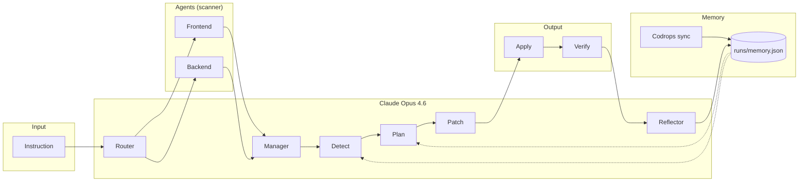

# Hackathon Demo Script

---

## Problem Statement

**"Who owns this?" shouldn't be the hardest question on the standup.** PMs and engineers burn hours turning "we need a11y" or "harden the API" into tickets, splitting frontend vs backend, chasing priorities, and still watching handoffs slip and context get lost. The gap between **what we asked for** and **what actually shipped** stays wide — not because the team isn't smart, but because coordination is the bottleneck. We wanted one place where a **single instruction** goes to a **coordinated team** that routes, prioritizes, plans, and ships a real patch. No ticket ping-pong. No "assign to frontend or backend?" — the system decides. **Nexus is that team:** one instruction in, one workflow, patches you can review and verify, and memory so the next run is smarter. Built with Claude Opus 4.6 at every step.

**Short (for slide):**
- **Problem:** Coordination is the bottleneck. "Who owns this?" → tickets, frontend/backend, handoffs. Ask ≠ ship.
- **Solution:** One instruction → Nexus (Router → Detect → Plan → Patch → Apply → Verify). Real patches. Memory. Claude Opus 4.6.

---

## Architecture

```
┌───────────────────────────────────────────────────────────────────┐
│  NEXUS — Architecture                                             │
├───────────────────────────────────────────────────────────────────┤
│  Instruction → [Claude: Router] → Frontend + Backend agents       │
│       → [Claude: Manager] (prioritize + assign)                   │
│       → [Claude: Detect] → [Claude: Plan] → [Claude: Patch]      │
│       → Apply (git) → Verify (build) → [Claude: Reflector]       │
│       → Memory                                                    │
│  Memory ← Codrops sync (external knowledge)                      │
│  Memory → used by Detect + Plan on next run                       │
└───────────────────────────────────────────────────────────────────┘
```

### Mermaid diagram (copy into [mermaid.live](https://mermaid.live))



You can also open `http://localhost:3000/architecture.html` (with dev server running) for a visual diagram.

---

## Quick Setup

1. **Install dependencies**
   ```bash
   npm install
   ```

2. **Set up environment**
   Copy `.env.example` to `.env.local` and set:
   - `ANTHROPIC_API_KEY` — required for all Claude steps
   - `GITHUB_TOKEN` — optional, only for Create PR

3. **Start the dashboard**
   ```bash
   npm run dev
   ```
   Open http://localhost:3000

4. **Set target repo** — Set **Target repo** in the dashboard to the absolute path of the repo you want to patch. The included `demo-next/` folder works as a sample target:
   ```bash
   cd demo-next && npm install
   ```

5. **Run** — Leave instruction empty for default, or type one. Click **Run End-to-End** or **Quick Demo**.

---

## Slide Content + Voiceover (3 min)

| Slide | Content | Voiceover |
|-------|---------|-----------|
| 1 — Title | Nexus · Autonomous AI Engineering Team · Built with Claude Opus 4.6 | One instruction in, real patches out. Built with Claude Opus 4.6. |
| 2 — Problem | "Who owns this?" → tickets, split, handoffs. Ask ≠ ship. | Coordination is stressful; what we ask for and what ships don't match. |
| 3 — Solution | One instruction → Nexus → real patch. Ticketing + solving built in. | One instruction → prioritize, assign, detect, plan, patch. No separate ticket tool. |
| 4 — Architecture | Diagram (Instruction → Router → ... → Memory). | Walk through the six Claude steps + memory loop. |
| 5 — Use cases | Same repo: A11y · API safety · Deps · Performance | Same pipeline, different presets — not one trick. |
| 6 — Live demo / CTA | Live: instruction → Run E2E → Patch → Apply → Verify | Here's the product. One instruction, run, apply, verify. Thanks — we're Nexus. |

### Full Voiceover (slow delivery)

**Slide 1:**
"This is Nexus. ... An autonomous AI engineering team. ... One instruction in. ... Real patches out. ... Built with Claude Opus 4.6."

**Slide 2:**
"PM and team coordination is stressful. ... Turning one ask into tickets. ... Frontend versus backend. ... Handoffs. ... What we asked for and what shipped ... never quite match. ... Coordination is the bottleneck."

**Slide 3:**
"We decided our product does ticketing and solving too. ... One instruction. ... The system prioritizes. ... Assigns. ... Detects. ... Plans. ... And patches. ... No separate ticket tool. ... One workflow. ... Real patches. ... And memory ... so the next run is smarter."

**Slide 4:**
"This slide is just Claude's role. ... One instruction goes to the Router. ... Frontend, backend, or full stack. ... After the agents scan ... the Manager prioritizes and assigns. ... Then Claude Detects. ... Plans. ... And Patches. ... After we apply and verify ... the Reflector writes learnings to memory. ... And memory feeds back ... into Detect and Plan. ... Six distinct Claude steps. ... With extended thinking ... visible in the UI."

**Slide 5:**
"It's not one trick. ... Same repo. ... Same pipeline. ... Presets for a11y and loading. ... API safety and validation. ... Dependencies and types. ... Performance and UX. ... One instruction. ... Different goals."

**Slide 6:**
"Here's the product. ... One instruction. ... Run End-to-End. ... You see the plan. ... The patch. ... Then Apply and Verify. ... Real codebase. ... Real patches. ... Thanks. ... We're Nexus."

---

## Demo Prompts (what to try)

| Goal | Prompt |
|------|--------|
| **Loading** | Add a skeleton loader for the Knowledge base results grid while search is loading, instead of only the small spinner. |
| **Empty state** | Make the "No results found" empty state friendlier: add an icon, short suggestion, and a "Clear search" button. |
| **A11y** | Add visible focus rings to all nav links and buttons. Ensure the hero buttons have aria-labels. |
| **Hero feedback** | Add a subtle hover scale or shadow to the hero CTA buttons. |
| **Search UX** | Show "Searching..." text next to the spinner while loading. Disable the search input while a request is in flight. |
| **Footer** | Add a "Back to top" link in the footer that scrolls smoothly to the top. |

---

## Use Cases

| Use case | What it does | Why it stands out |
|----------|-------------|-------------------|
| **A11y & loading** | ARIA, focus, loading states, empty states | Frontend quality + inclusivity |
| **API safety & validation** | Input validation (Zod), error shapes, safety headers | Backend hardening; Claude routes to backend agent |
| **Dependencies & types** | Safe dependency updates, TypeScript fixes | Maintenance and reliability |
| **Performance & UX** | Image optimization, lazy loading, layout shift | Real user impact; full-stack focus |

---

## 30-Second Pitch

**Nexus** — One instruction. Claude decides what to focus on (router), then agents run: scan → detect → plan → patch → apply → verify. Claude Opus 4.6 is used as orchestrator (router), reviewer (detect), planner, patcher, manager, and reflector; learnings from each run are used in the next. Real patches you can review; build verification. Not a single prompt — a full engineering workflow.

---

## Submission Form (copy-paste)

**Proper use of Claude Opus 4.6:** We use Claude as orchestrator (Router decides frontend vs backend focus from one sentence), reviewer (Detect), planner, patcher, Manager (prioritize), and Reflector (learnings that Detect and Plan use on the next run). Not a single code-generation prompt — six distinct Claude steps in one pipeline, with memory across runs.

**Uniqueness:** Claude doesn't just generate code; it decides which parts of the codebase to focus on and writes learnings that the next run actually uses. One instruction → full workflow → patch you can review and verify. Multiple use cases on the same repo (a11y, API safety, deps, performance) show it's a platform, not a single demo.

---

## Troubleshooting

| Issue | Fix |
|-------|-----|
| Detect/Plan/Patch error | Check `ANTHROPIC_API_KEY` in `.env.local` |
| Patch failed / no patch | Try a simpler instruction; ensure target repo is clean (`git status`) |
| Apply failed: corrupt patch | Generated diff was malformed. Run again; don't edit the repo between run and apply. |
| Create PR failed | Add `GITHUB_TOKEN` to `.env.local` (repo scope) |
| No memories | Run the pipeline at least once, or click "Sync from Codrops" |
| Target repo not found | Use the full absolute path (e.g. `C:\...\demo-next` or `/home/.../demo-next`) |
